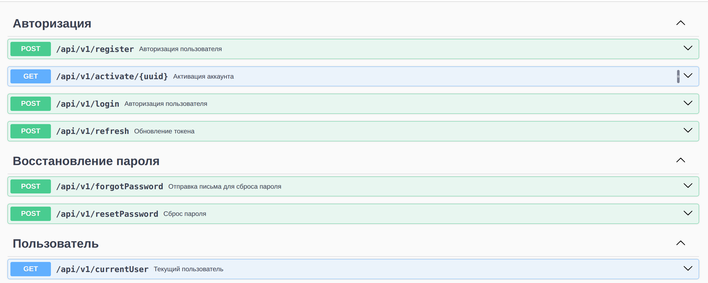

## Инструкция по запуску

### 1. Настройка окружения

Заполните файлы переменных окружения:

- `.env.dev` — для разработки (development)
- `.env.prod` — для продакшена (production)

### 2. Сборка проекта

Соберите проект через Docker Compose с помощью Makefile:

**Для development среды:**

```bash
make build-dev
```

**Для production среды:**

```bash
make build
```

### 3. После запуска проекта Swagger документация доступна по следующим эндпоинтам:

Swagger UI: /swagger
Swagger JSON: /swagger/json


